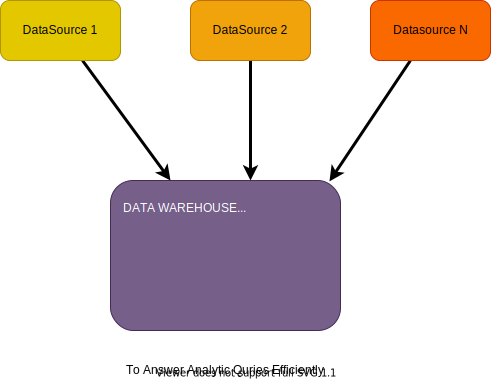
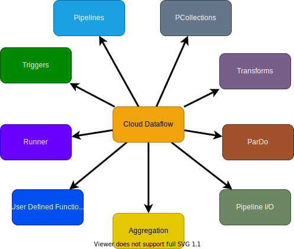

# Designing a Data Processing Solution

__Data Pipeline:__ sequence of operations that copy, transform, load & analyze data.

DAGs: Directed Acyclic Graphs (DAGs)

## 4 Stages of Data Pipelines

1. __Ingestion__: Bringing data into ecosystem - batch or streaming mode.
2. __Transformation__: one from to another. Type change, define default, aggregate, filter, joining, dropping, adding.
3. __Storage__: based on the data type, size, throughput and use case - data can be stored into different storage system.
4. __Analysis__
   - Simple SQL query (BigQuery)
   - report genration (Data Studio)
   - Machine Learning model training (Cloud Datalab - Jupyter Notebooks)
   - Data Science Analysis
   - Large Scale Machine Learning Model (DataProc - Spark - ML Libraries)

## Types of Data Pipelines

1. Data Warehousing Pipelines
   1. ETL: Extraction Transformation & Load - Dataflow or Dataproc. Dataflow is recommended.
   2. ELT: Extraction Load & Transformation - Transform in the DB side - no programming knowledge required.
   3. EL: Extraction & Load
   4. Change Data Capture: track each change and capture.

2. Stream Processing Pipelines: Factors of designing Stream processing pipeline:
   1. Event time & processing time
   2. Sliding & Tumbling windows
   3. Late arriving data & watermarks
   4. Missing Data

3. Machine Learning Pipelines
   1. Data Ingestion (Cloud Storage / Cloud PubSub)
   2. Data Preparation / Pre-Processing (DataProc / DataFlow / DataPrep)
   3. Data segregation / Feature Engineering
   4. Model Training
   5. Model Evulation
   6. Model Deployment
   7. Model Monitoring

## Components

### Data Warehouse

### Cloud Dataflow

### Cloud Dataproc

- Hadoop
- Spark

### Cloud Composer

- Apache Airflow: scheduling, monitoring and managing workflow.
- What is a workflow? - Python instructions.

## Further Improvement
1. [Hadoop 101](https://courses.cognitiveclass.ai/courses/course-v1:BigDataUniversity+BD0111EN+v1/course/)
2. [Spark Fundamentals I](https://courses.cognitiveclass.ai/courses/course-v1:BigDataUniversity+BD0211EN+v1/course/)