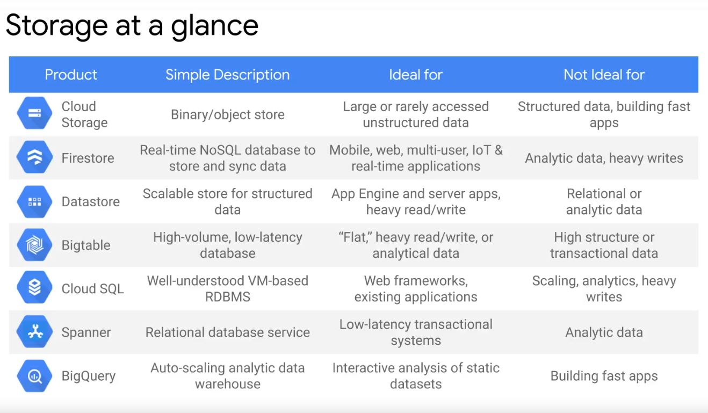

# [Overview of Data Storage Options](https://googlecourses.qwiklabs.com/course_sessions/513169/video/101448)




## Connect Cloud SQL database from Cloud Shell

```bash
gcloud beta sql connect <NAME_OF_YOUR_CLOUD_SQL_INSTANCE> --user=root
```


## Connect Clodu SQL from a VM

_install mysql client_

```bash
sudo apt-get update -y

sudo apt-get install mysql-client git -y
```

_Let's see if it works_

```bash
mysql -u root -p --host 104.198.195.141
```

104.198.195.141 = IP address of your cloud SQL instance


## Connect Cloud SQL through cloud SQL proxy: recommended way

_download cloud sql proxy in your machine_

```bash
wget https://dl.google.com/cloudsql/cloud_sql_proxy.linux.amd64 -O cloud_sql_proxy
```

_make the file executable_

```bash
chmod +x cloud_sql_proxy
```

_make cloud sql proxy to listen for db requests_

```bash
./cloud_sql_proxy -instances=app-dev-demos:us-central1:cloud-sql-demo=tcp:3306
```

app-dev-demos = `instance connection name` from the cloud sql portal

_now you can SSH into your mysql using localhost_

```bash
mysql -u root -p --host 127.0.0.1
```